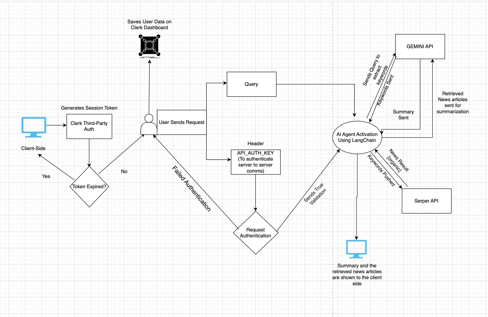

# News Agent Service ** This is not updated-we will be updating the readme shortly

## Overview

This project is a **Conversational AI-powered News Aggregation System** built using **Flask**, **LangChain**, and **Google Gemini API**. It enables users to **ask questions about recent news** and receive **summarized responses** along with relevant news articles.

##  Features

- **Conversational AI**: Uses **Gemini** to understand user queries and generate responses.
- **Real-time News Fetching**: Fetches news articles using **Serper API**.
- **Summarization**: Uses Gemini to summarize news articles.
- **Memory Storage**: Retains conversation history for context-aware responses.
- **Secure API Authentication**: Uses API keys for server-to-server security.

## Tech Stack

- **Frontend**: Next.js (Clerk for authentication)
- **Backend**: Flask (Blueprints for modular routing)
- **LLM**: Google Gemini via LangChain
- **News Fetching**: Serper API
- **Memory & Workflow Orchestration**: LangChain Agents & Tools

---


##  API Endpoints

###  `/news/ask` (POST)

**Purpose**: Takes a user query, retrieves relevant news articles, and returns an AI-generated summary.

📌Request:

```json
POST /news/ask
Headers: { "API_AUTH_KEY": "your-secret-key" }
Body:
{
  "query": "What are the latest AI advancements?"
}
```

 **Response:**

```json
{
  "success": true,
  "response": "AI is making progress in deep learning...",
  "sources": [
    { "title": "New AI Model", "link": "https://example.com", "source": "TechCrunch" }
  ]
}
```

###  `/news/clear` (POST)

**Purpose**: Clears the conversation history.

 **Request:**

```json
POST /news/clear
Headers: { "API_AUTH_KEY": "your-secret-key" }
```

 **Response:**

```json
{
  "success": true,
  "message": "Conversation history cleared"
}
```

###  `/news/history` (GET)

**Purpose**: Retrieves stored conversation history.

Request:

```json
GET /news/history
Headers: { "API_AUTH_KEY": "your-secret-key" }
```

 **Response:**

```json
{
  "success": true,
  "history": [
    { "role": "user", "content": "Tell me about AI" },
    { "role": "ai", "content": "AI is progressing rapidly in NLP..." }
  ]
}
```

---

## Session Management

The API supports persistent chat sessions stored in MongoDB, allowing users to maintain conversations across multiple requests and resume them later.

### Session Features

- **Per-User Sessions**: Each session is associated with a specific user ID
- **Persistent Memory**: Conversation history stored in MongoDB
- **Multiple Sessions**: Users can maintain multiple named conversations
- **Session Security**: Users can only access their own sessions

### Session Endpoints

#### `/news/session/start` (POST)

**Purpose**: Creates a new chat session and returns a session ID.

**Request:**

```json
POST /news/session/start
Headers: { "API_AUTH_KEY": "your-secret-key" }
Body:
{
  "user_id": "user123"
}
```

**Response:**

```json
{
  "success": true,
  "session_id": "550e8400-e29b-41d4-a716-446655440000"
}
```

#### `/news/session/{session_id}/ask` (POST)

**Purpose**: Sends a query within a specific session, maintaining conversation context.

**Request:**

```json
POST /news/session/550e8400-e29b-41d4-a716-446655440000/ask
Headers: { "API_AUTH_KEY": "your-secret-key" }
Body:
{
  "user_id": "user123",
  "query": "What are the latest developments in AI?"
}
```

**Response:**

```json
{
  "success": true,
  "session_id": "550e8400-e29b-41d4-a716-446655440000",
  "response": "Recent AI developments include...",
  "sources": [
    { "title": "New AI Research", "link": "https://example.com", "source": "TechJournal" }
  ]
}
```

#### `/news/sessions` (GET)

**Purpose**: Lists all sessions for a specific user.

**Request:**

```json
GET /news/sessions?user_id=user123
Headers: { "API_AUTH_KEY": "your-secret-key" }
```

**Response:**

```json
{
  "success": true,
  "sessions": [
    {
      "session_id": "550e8400-e29b-41d4-a716-446655440000",
      "created_at": "2025-04-17T10:30:00Z"
    },
    {
      "session_id": "7397a1d8-979c-4b74-a28d-3c324931ca82",
      "created_at": "2025-04-16T14:20:00Z"
    }
  ]
}
```

#### `/news/session/{session_id}/history` (GET)

**Purpose**: Retrieves the conversation history for a specific session.

**Request:**

```json
GET /news/session/550e8400-e29b-41d4-a716-446655440000/history?user_id=user123
Headers: { "API_AUTH_KEY": "your-secret-key" }
```

**Response:**

```json
{
  "success": true,
  "history": [
    {
      "role": "user",
      "content": "What are the latest developments in AI?",
      "timestamp": "2025-04-17T10:32:00Z"
    },
    {
      "role": "ai",
      "content": "Recent AI developments include...",
      "timestamp": "2025-04-17T10:32:05Z"
    }
  ]
}
```

#### `/news/session/{session_id}/clear` (POST)

**Purpose**: Clears the message history for a specific session.

**Request:**

```json
POST /news/session/550e8400-e29b-41d4-a716-446655440000/clear
Headers: { "API_AUTH_KEY": "your-secret-key" }
Body:
{
  "user_id": "user123"
}
```

**Response:**

```json
{
  "success": true,
  "message": "Session cleared"
}
```

#### `/news/session/{session_id}/delete` (DELETE)

**Purpose**: Completely deletes a session.

**Request:**

```json
DELETE /news/session/550e8400-e29b-41d4-a716-446655440000/delete
Headers: { "API_AUTH_KEY": "your-secret-key" }
Body:
{
  "user_id": "user123"
}
```

**Response:**

```json
{
  "success": true,
  "message": "Session deleted"
}
```

### Session-Aware Standard Endpoints

The standard `/news/ask` endpoint now also supports persistent sessions by automatically creating and using a default session for each user:

```json
POST /news/ask
Headers: { "API_AUTH_KEY": "your-secret-key" }
Body:
{
  "user_id": "user123",
  "query": "Tell me about recent space discoveries"
}
```

This will automatically maintain conversation context between requests for the same user.

---

## How It Works

1️⃣ **User submits a prompt** via the frontend. 2️⃣ **Backend authenticates the request** (checks API key & JWT from Clerk). 3️⃣ **AI extracts keywords** from the query (using Gemini). 4️⃣ **NewsAgentService fetches relevant articles** via Serper API. 5️⃣ **AI summarizes** the news articles and generates a response. 6️⃣ **Response is sent back** to the frontend. 7️⃣ **Conversation history is stored** (optional).

---

##  LangChain's Role

LangChain plays a vital role in: ✔ **Managing AI decision-making** (ReAct agents) ✔ **Integrating third-party APIs** (Google Gemini, Serper API) ✔ **Handling multi-step workflows** (Keyword Extraction → News Fetching → Summarization) ✔ **Retaining memory** (Conversation context for follow-ups) ✔ **Ensuring structured outputs** (Standardized JSON responses) ✔ **Automating retries and error handling** (Ensuring stability)

---

##  Installation & Setup

### **Clone the Repository**

```bash
git clone https://github.com/your-username/news-agent-service.git
cd news-agent-service
```

### \*\* Set Up Virtual Environment\*\*

```bash
python3 -m venv venv
source venv/bin/activate  # On Windows use: venv\Scripts\activate
```

### \*\* Install Dependencies\*\*

```bash
pip install -r requirements.txt
```

### **Set Up Environment Variables**

Create a `.env` file in the root directory:

```bash
GOOGLE_API_KEY=your-google-api-key
SERPER_API_KEY=your-serper-api-key
API_AUTH_KEY=your-secret-auth-key
```

### ** Run the Flask App**

```bash
flask run
```

The API will be available at `http://127.0.0.1:5000/news`

---

##
---

## Security Considerations

✔ **API Key Authentication**: Protects the backend from unauthorized requests. ✔ **Rate Limiting**: (Recommended) Prevent abuse with Flask-Limiter. ✔ **CORS Policy**: Restrict frontend domains from accessing unauthorized resources. ✔ **Error Handling & Logging**: Logs all exceptions for debugging. ✔ **Sensitive Data Storage**: API keys are stored in `.env`, never hardcoded.

---

## License

This project is **MIT Licensed**. You are free to use, modify, and distribute it with attribution.

---

##  Contributing

1. **Fork the repo** and create a new branch.
2. **Make improvements & bug fixes.**
3. **Submit a Pull Request.**

For discussions, **open an issue** or reach out via **email**.


